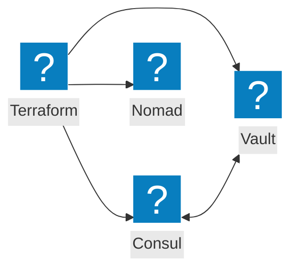
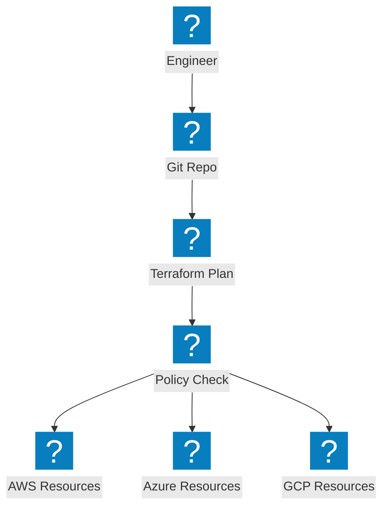

基础设施即代码图表，涵盖 Terraform 自动化、HashiCorp 工具集成及多云资源配置工作流。

## HashiCorp 技术栈集成

Terraform 协调基础设施配置，结合 Consul 实现服务发现、Vault 管理密钥，以及 Nomad 进行工作负载调度。

## 多云 IaC 流水线

Terraform 跨 AWS、Azure 和 GCP 配置基础设施，并进行状态管理与策略执行。

## F5 XC 基础设施自动化

Terraform 自动化 F5 分布式云配置，涵盖负载均衡器、源池及安全策略。

```mermaid
architecture-beta
  group iac(hashicorp-flight:terraform-color)[Terraform Workspace]
  group xc(lucide:cloud)[F5 XC Tenant]

  service tfplan(hashicorp-flight:terraform-color)[Terraform] in iac
  service vault(hashicorp-flight:vault-color)[Vault Secrets] in iac
  service consul(hashicorp-flight:consul-color)[Consul Registry] in iac
  service waap(f5xc:web-app-and-api-protection)[WAAP Policy] in xc
  service lb(f5xc:multi-cloud-app-connect)[App Connect] in xc
  service dns(f5xc:dns-management)[DNS Config] in xc

  tfplan:R --> L:vault
  vault:R --> L:consul
  tfplan:B --> T:waap
  tfplan:B --> T:lb
  tfplan:B --> T:dns
```

