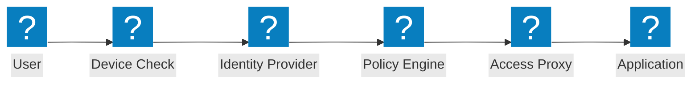
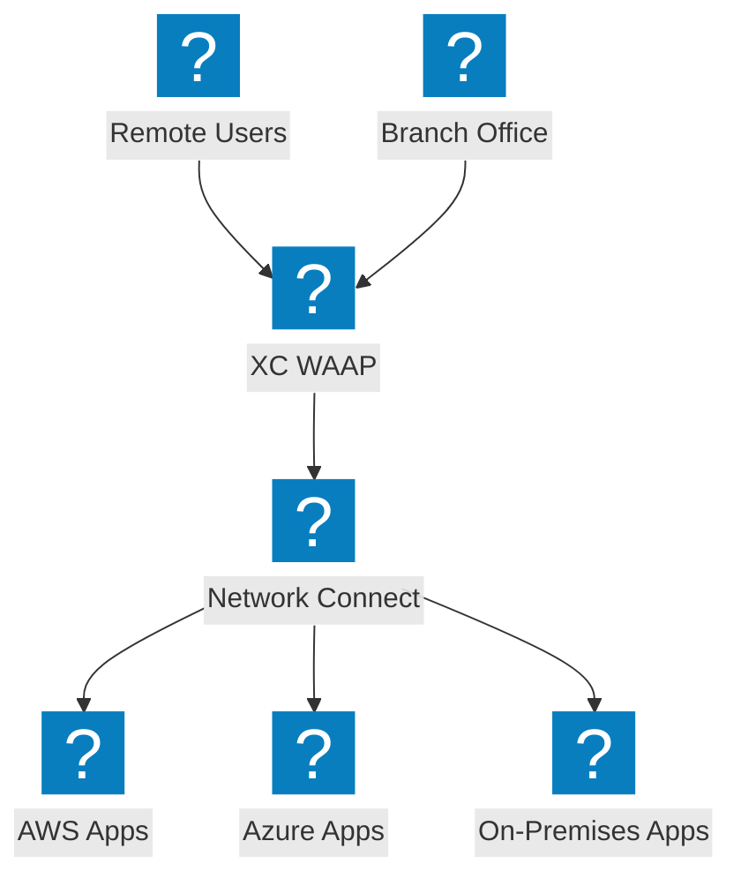

零信任架构图，涵盖 ZTNA 访问流程、身份验证、基于策略的访问控制，以及与 F5 XC 集成的微分段。

## 零信任访问流程

包含设备状态检查、身份验证、策略评估和代理应用访问的零信任访问流程。

## F5 XC 零信任架构

F5 分布式云通过 WAAP、身份感知代理和跨云微分段提供零信任应用访问。

## 微分段架构

基于身份策略的网络微分段，控制应用层级之间的东西向流量。

```mermaid
architecture-beta
  group trust(lucide:shield)[Zero Trust Fabric]
  group apps(carbon:cloud-services)[Application Tiers]

  service idp(lucide:key)[Identity Provider] in trust
  service policy(carbon:gateway-security)[Policy Engine] in trust
  service seg(carbon:subnet-acl-rules)[Segmentation] in trust
  service web(carbon:application)[Web Tier] in apps
  service api(carbon:api)[API Tier] in apps
  service data(carbon:data-base)[Data Tier] in apps

  idp:R --> L:policy
  policy:R --> L:seg
  seg:R --> L:web
  web:R --> L:api
  api:R --> L:data
```

