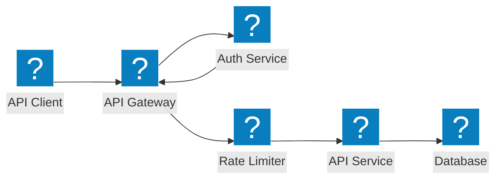
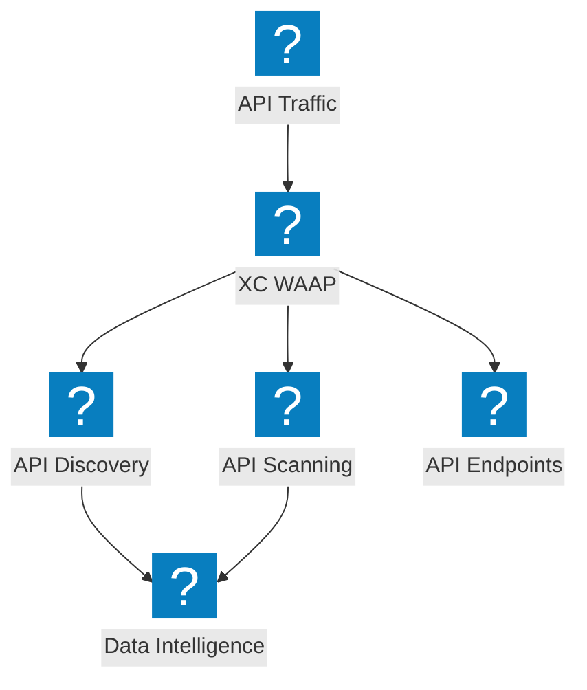

API 保護架構圖，涵蓋 API 閘道安全、影子 API 探索、速率限制，以及結合 F5 Distributed Cloud 的結構描述驗證。

## API 閘道安全

API 閘道在請求抵達後端服務前，執行身份驗證、授權、速率限制及結構描述驗證。

## F5 XC API 探索與保護

F5 Distributed Cloud 提供 API 探索、影子 API 偵測及全面的 API 安全防護，並具備流量洞察能力。

## API 安全流水線

多階段 API 請求驗證流水線，涵蓋 TLS、JWT 驗證、速率限制及酬載檢查。

```mermaid
architecture-beta
  group security(lucide:shield)[API Security Layer]
  group backend(carbon:cloud-services)[Backend Services]

  service tls(lucide:lock)[TLS Termination] in security
  service jwt(lucide:key)[JWT Validation] in security
  service rate(carbon:load-balancer-vpc)[Rate Limiter] in security
  service schema(carbon:gateway-security)[Schema Validation] in security
  service api1(carbon:api)[Users API] in backend
  service api2(carbon:api)[Orders API] in backend

  tls:R --> L:jwt
  jwt:R --> L:rate
  rate:R --> L:schema
  schema:R --> L:api1
  schema:B --> T:api2
```

