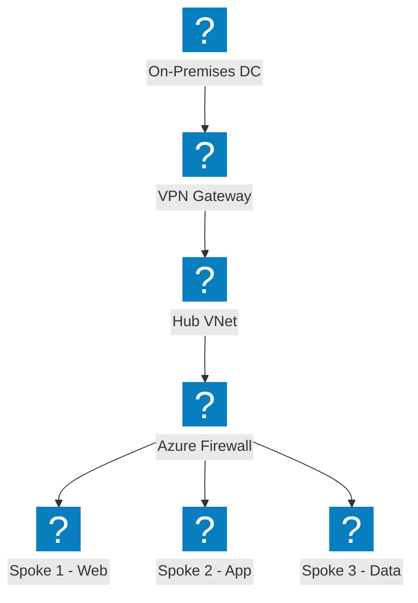
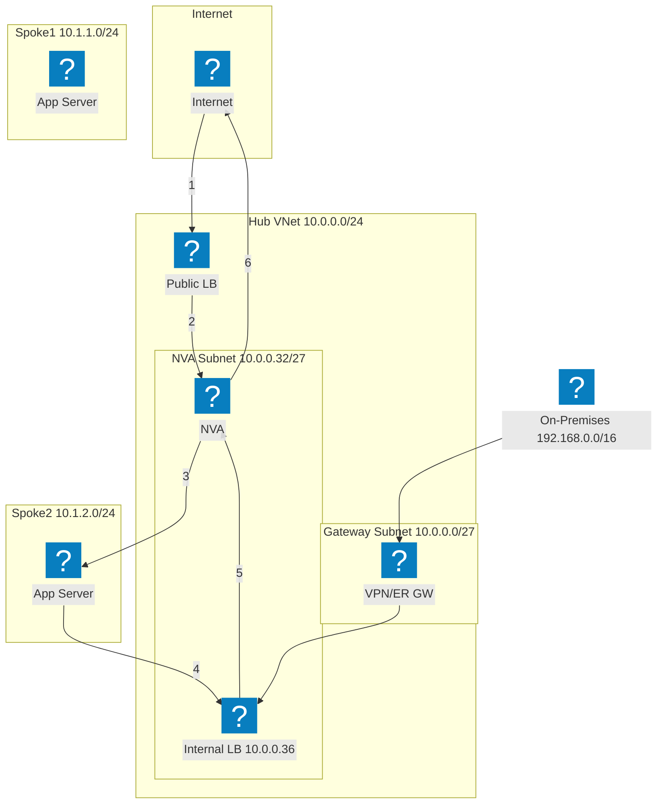
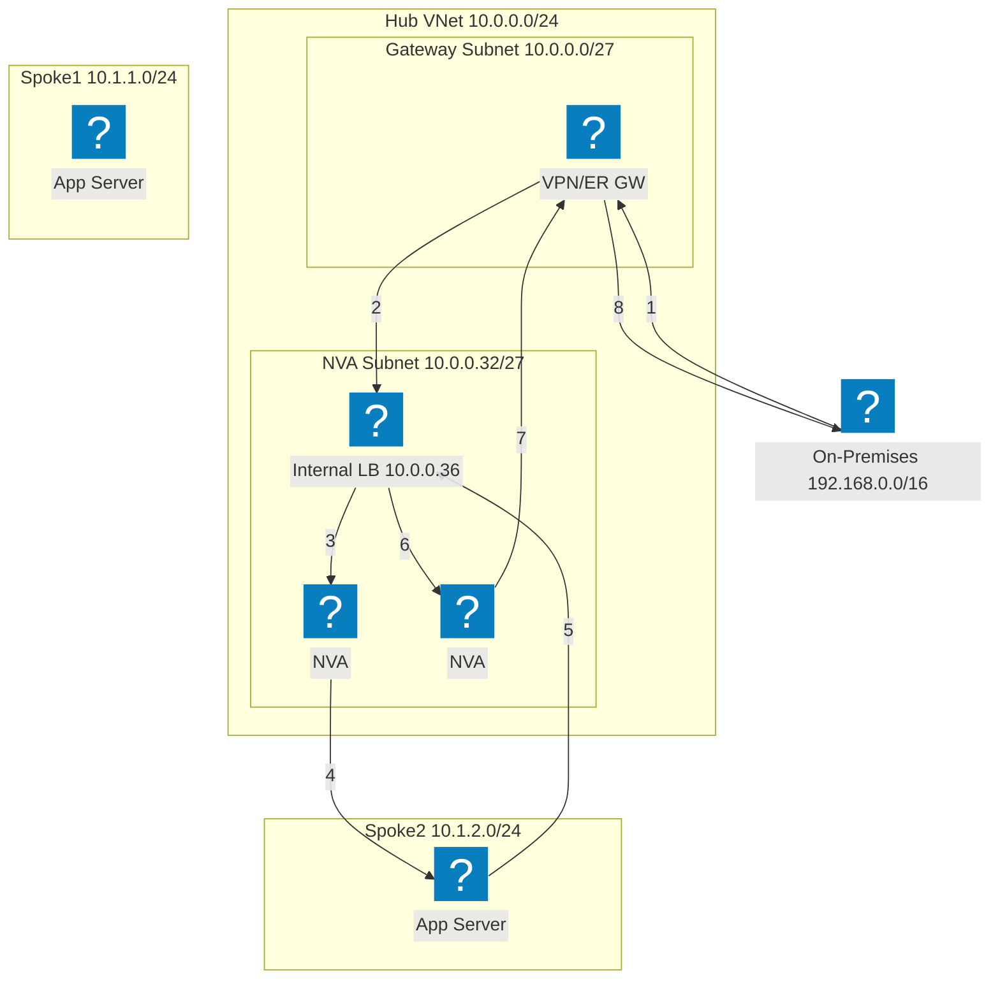
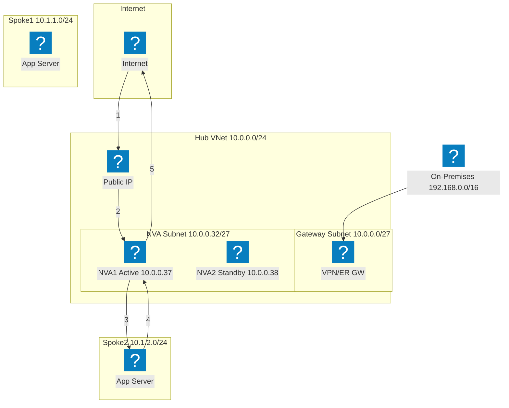
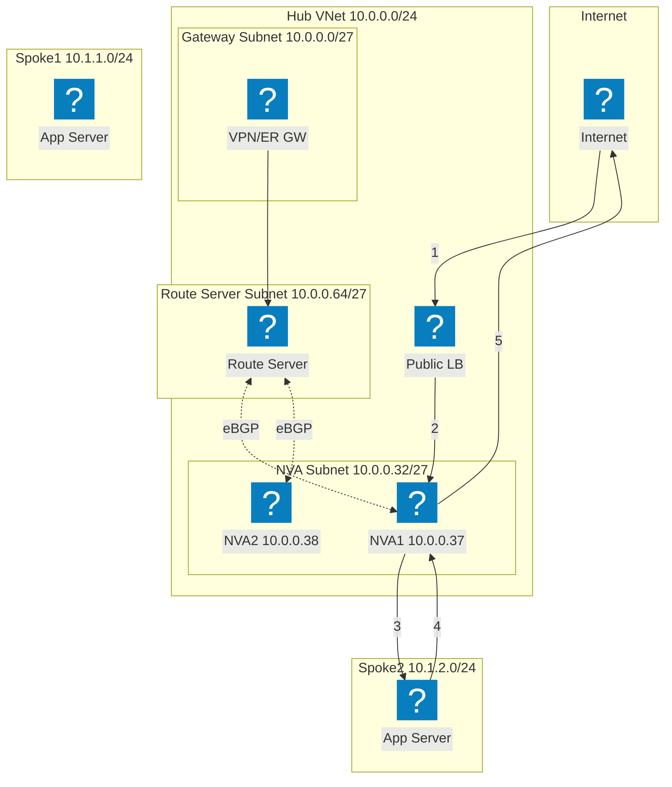
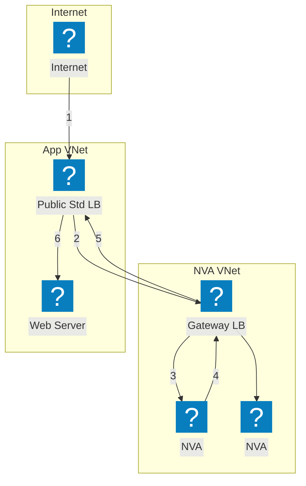

使用 HashiCorp Flight 和 Carbon 圖示包的 Azure 基礎架構圖，涵蓋 VNet 網路、運算及受管服務。

## VNet 搭配 App Gateway

Azure VNet 包含閘道、應用程式及資料子網路。Application Gateway 將流量分配至 VM Scale Sets。

```mermaid
architecture-beta
  group vnet(carbon:virtual-private-cloud)[Azure VNet]
  group gwsub(carbon:ibm-cloud-subnets)[Gateway Subnet] in vnet
  group appsub(carbon:ibm-cloud-subnets)[App Subnet] in vnet
  group datasub(carbon:ibm-cloud-subnets)[Data Subnet] in vnet

  service appgw(carbon:gateway-security)[App Gateway] in gwsub
  service vm1(hashicorp-flight:azure-vms-color)[VM Scale Set] in appsub
  service vm2(hashicorp-flight:azure-vms-color)[VM Scale Set] in appsub
  service sqldb(carbon:data-base)[Azure SQL] in datasub

  appgw:R --> L:vm1
  appgw:B --> T:vm2
  vm1:R --> L:sqldb
  vm2:R --> L:sqldb
```

## AKS 搭配 F5 XC 多雲連接

Azure Kubernetes Service 由 F5 Distributed Cloud 作為前端，提供多雲應用程式連接與安全性。

```mermaid
architecture-beta
  group xc(lucide:cloud)[F5 XC]
  group aks(hashicorp-flight:azure-aks-color)[AKS Cluster]

  service mcn(f5xc:multi-cloud-network-connect)[Network Connect] in xc
  service waap(f5xc:web-app-and-api-protection)[WAAP] in xc
  service ingress(carbon:gateway)[Ingress] in aks
  service app(hashicorp-flight:docker-color)[App Pods] in aks
  service cache(carbon:datastore)[Redis Cache] in aks
  service blob(hashicorp-flight:azure-blob-storage-color)[Blob Storage]

  mcn:R --> L:waap
  waap:R --> L:ingress
  ingress:R --> L:app
  app:B --> T:cache
  app:R --> L:blob
```

## Hub-Spoke 網路拓撲

Azure Hub-Spoke 架構，透過集中式安全性與共用服務連接多個 Spoke VNet。

## NVA 高可用性搭配負載平衡器 — 網際網路流量

入站網際網路流量到達公用負載平衡器，再分配至 Hub 中的 NVA 執行個體。NVA 將檢查後的流量轉送至 Spoke 工作負載。Spoke 的回程流量透過內部負載平衡器路由回 NVA 進行出站。編號步驟顯示入站路徑（1-3）與回程路徑（4-6）。

## NVA 高可用性搭配負載平衡器 — 內部部署流量

內部部署流量透過 VPN 或 ExpressRoute 閘道進入，並導向至作為多個 NVA 執行個體前端的內部負載平衡器。NVA 檢查並轉送流量至 Spoke 工作負載。回程流量經由相同的內部負載平衡器傳輸，以確保流量對稱，防止非對稱路由問題。

## NVA 高可用性搭配公用 IP/UDR — 主動/備用模式

主動/備用 NVA 配對，由主動執行個體（NVA1）持有公用 IP 位址。發生故障時，備用的 NVA2 呼叫 Azure API 重新指派公用 IP，並更新使用者定義路由以指向自身。此方式無需負載平衡器，但需要 API 層級的容錯移轉協調。

## NVA 高可用性搭配 Azure Route Server

使用 Azure Route Server 的 BGP 高可用性方案。Route Server 與兩個 NVA 執行個體建立 eBGP 鄰居關係，並動態設定 Spoke 的有效路由。ECMP 在各 NVA 間進行負載平衡，無需使用者定義路由。Route Server 將兩個 NVA IP 的下一躍點項目注入所有對等 VNet。

## NVA 高可用性搭配 Gateway Load Balancer

使用 Azure Gateway Load Balancer 進行透明 NVA 插入。流量目的地為應用程式時，會從公用標準負載平衡器透明地導向至獨立 NVA VNet 中的 Gateway LB。NVA 檢查流量後將其返回 Gateway LB，再轉送回應用程式。NVA 與應用程式 VNet 之間無需 VNet 對等互連或使用者定義路由。

