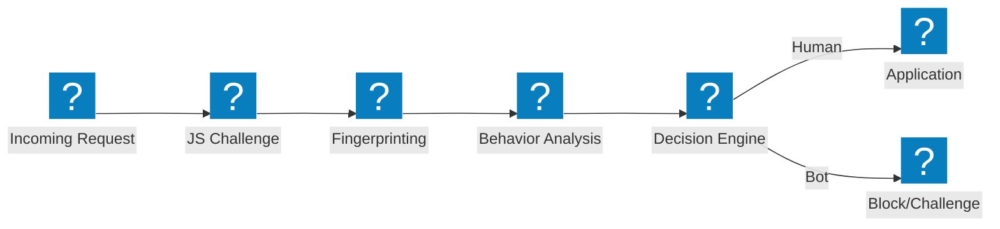
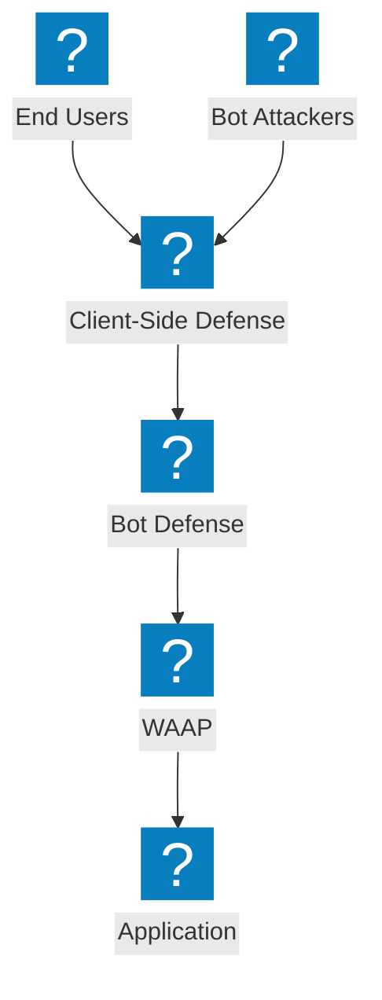

機器人防禦架構圖，涵蓋偵測管線、憑證填充緩解、用戶端防禦及 F5 Distributed Cloud 機器人管理功能。

## 機器人偵測管線

多階段機器人偵測管線，在允許存取前依序執行 JavaScript 挑戰、行為分析及指紋識別。

## F5 XC 機器人防禦與用戶端防禦

F5 Distributed Cloud 整合式機器人防禦，搭配用戶端保護，防範憑證填充及帳戶盜取。

## 憑證填充防禦架構

針對憑證填充攻擊的多層防禦，整合裝置指紋識別、憑證情資及帳戶保護。

