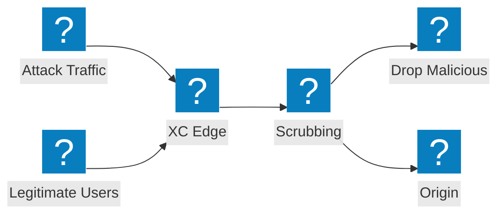

DDoS 緩解架構圖，涵蓋清洗中心設計、傳輸服務整合，以及 F5 Distributed Cloud 大規模流量攻擊防護。

## DDoS 緩解架構

多層式 DDoS 緩解機制，包含網路層清洗、應用層檢測，以及將乾淨流量傳遞至來源端。

```mermaid
architecture-beta
  group scrub(lucide:shield)[Scrubbing Center]
  group origin(carbon:cloud-services)[Origin DC]

  service edge(carbon:edge-node)[Edge Router] in scrub
  service filter(carbon:firewall)[Traffic Filter] in scrub
  service clean(carbon:load-balancer-global)[Clean Pipe] in scrub
  service lb(carbon:load-balancer-application)[Load Balancer] in origin
  service app(carbon:application)[Application] in origin
  service db(carbon:data-base)[Database] in origin

  edge:R --> L:filter
  filter:R --> L:clean
  clean:R --> L:lb
  lb:R --> L:app
  app:B --> T:db
```

## F5 XC DDoS 與傳輸服務

F5 Distributed Cloud 提供整合 CDN 及應用程式安全性的 DDoS 防護與傳輸服務。

```mermaid
architecture-beta
  group xc(lucide:cloud)[F5 Distributed Cloud]
  group cloud(carbon:cloud-services)[Cloud Infrastructure]

  service ddos(f5xc:ddos-and-transit-services)[DDoS Protection] in xc
  service cdn(f5xc:content-delivery-network)[CDN] in xc
  service waap(f5xc:web-app-and-api-protection)[WAAP] in xc
  service lb(carbon:load-balancer-application)[Load Balancer] in cloud
  service app(carbon:application)[App Cluster] in cloud
  service db(carbon:data-base)[Database] in cloud

  ddos:R --> L:cdn
  cdn:R --> L:waap
  waap:R --> L:lb
  lb:R --> L:app
  app:B --> T:db
```

## 大規模流量攻擊流程

攻擊流量流程圖，展示大規模 DDoS 攻擊如何在抵達來源基礎設施之前，於 F5 XC 邊緣節點被吸收並緩解。

