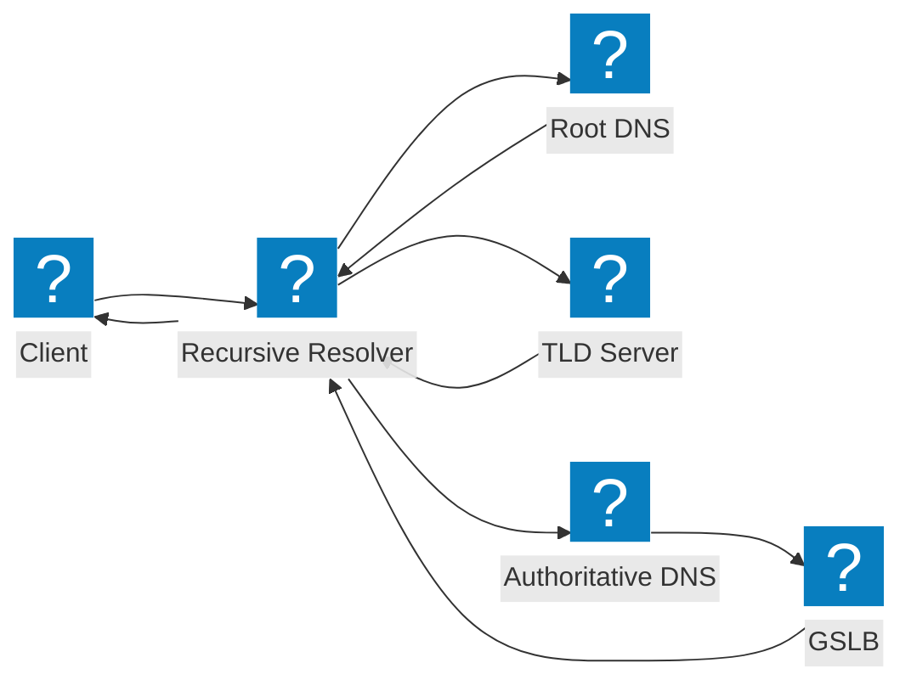
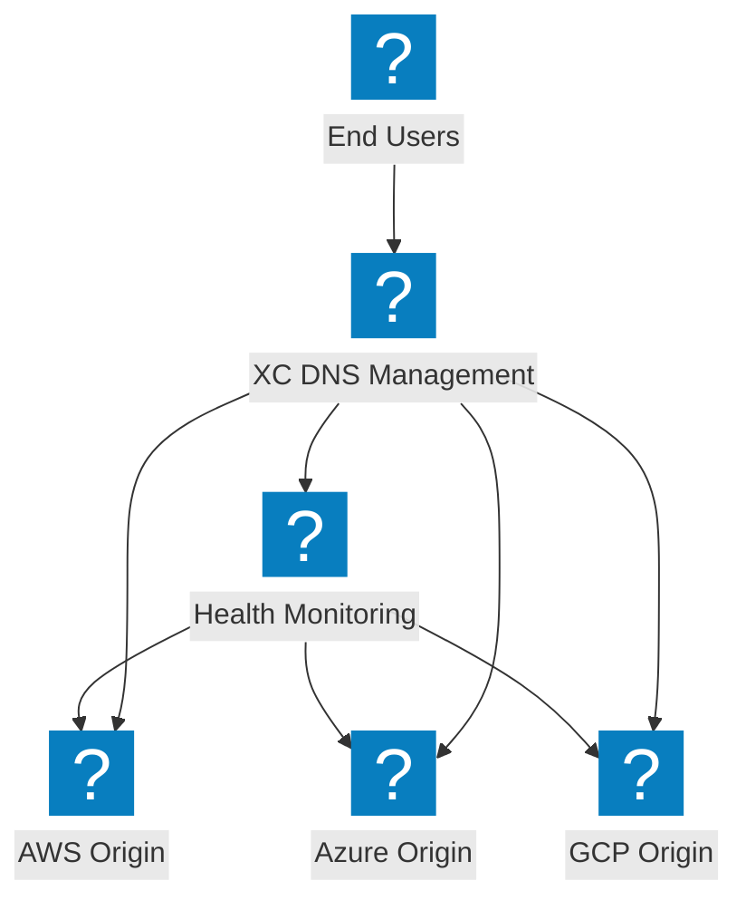

DNS 架構圖，涵蓋遞迴解析流程、全域伺服器負載平衡，以及 F5 Distributed Cloud DNS 管理。

## DNS 解析流程

標準 DNS 查詢解析流程，從客戶端經由遞迴解析器到具有 GSLB 整合的權威名稱伺服器。

## F5 XC DNS 管理

F5 Distributed Cloud DNS 管理，提供跨多雲來源的智慧型 DNS 負載平衡。

## DNS 負載平衡架構

多層 DNS 負載平衡，具備地理路由、健康檢查，以及雲端區域間的故障轉移機制。

```mermaid
architecture-beta
  group dns(carbon:dns-services)[DNS Infrastructure]
  group region1(hashicorp-flight:aws-color)[US East]
  group region2(hashicorp-flight:azure-color)[EU West]

  service gslb(carbon:load-balancer-global)[GSLB] in dns
  service health(carbon:application)[Health Check] in dns
  service lb1(carbon:load-balancer-application)[Regional LB] in region1
  service app1(carbon:virtual-machine)[App Servers] in region1
  service lb2(carbon:load-balancer-application)[Regional LB] in region2
  service app2(carbon:virtual-machine)[App Servers] in region2

  gslb:R --> L:health
  gslb:B --> T:lb1
  lb1:R --> L:app1
  gslb:B --> T:lb2
  lb2:R --> L:app2
```

