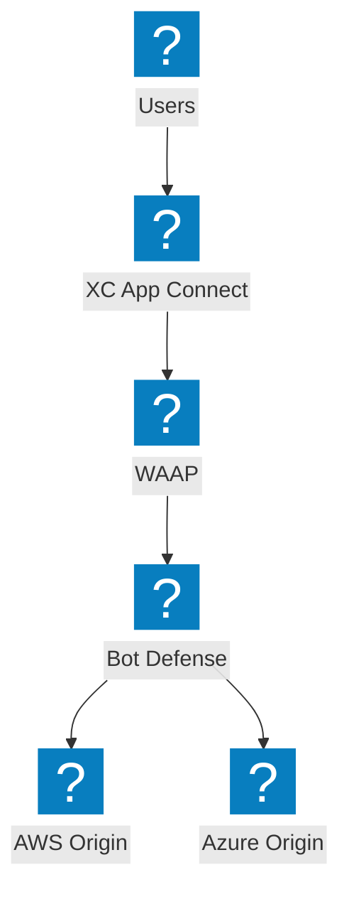
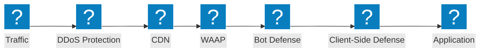

使用 `f5xc` 和 `f5-brand` 圖示包，展示 F5 XC 服務組合、NGINX 產品線及 BIG-IP 功能的 F5 產品圖示展示圖。

## F5 XC 服務組合

F5 分散式雲端服務總覽，涵蓋安全性、網路及應用程式交付。

## F5 XC 安全堆疊

完整的 F5 XC 安全堆疊，包含 WAAP、機器人防禦、用戶端防禦、DDoS 防護及 API 探索。

## F5 XC 網路服務

F5 分散式雲端網路服務，包含多雲連接、DNS 管理及分散式應用程式。

```mermaid
architecture-beta
  group xc(lucide:cloud)[F5 Distributed Cloud]
  group infra(carbon:cloud-services)[Infrastructure]

  service mcn(f5xc:multi-cloud-network-connect)[Network Connect] in xc
  service mca(f5xc:multi-cloud-app-connect)[App Connect] in xc
  service dns(f5xc:dns-management)[DNS Management] in xc
  service dapp(f5xc:distributed-apps)[Distributed Apps] in xc
  service k8s(hashicorp-flight:kubernetes-color)[K8s Clusters] in infra
  service vm(carbon:virtual-machine)[VM Workloads] in infra

  mcn:R --> L:mca
  mca:R --> L:dns
  dns:R --> L:dapp
  mcn:B --> T:k8s
  mca:B --> T:vm
```

## F5 XC 可觀測性與智慧分析

F5 分散式雲端可觀測性、流量洞察及資料智慧，提供全面的應用程式能見度。

```mermaid
architecture-beta
  group apps(carbon:cloud-services)[Application Layer]
  group intel(lucide:cloud)[F5 XC Intelligence]

  service app1(carbon:application)[Web App] in apps
  service app2(carbon:api)[API Service] in apps
  service app3(f5xc:distributed-apps)[Distributed App] in apps
  service obs(f5xc:observability)[Observability] in intel
  service ati(f5xc:application-traffic-insight)[Traffic Insight] in intel
  service di(f5xc:data-intelligence)[Data Intelligence] in intel

  app1:B --> T:obs
  app2:B --> T:ati
  app3:B --> T:di
  obs:R --> L:ati
  ati:R --> L:di
```

