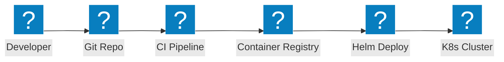

Kubernetes 架構圖，涵蓋入口控制器、服務網格模式、Pod 網路，以及使用 NGINX 和 F5 XC 整合的容器安全。

## 使用 NGINX 的 Kubernetes 入口

以容器為基礎的應用程式，使用 NGINX 入口控制器將流量分配至前端和後端 Pod。

```mermaid
architecture-beta
  group cluster(hashicorp-flight:kubernetes-color)[Kubernetes Cluster]
  group frontend(carbon:container-services)[Frontend Pods] in cluster
  group backend(carbon:container-services)[Backend Pods] in cluster

  service ingress(carbon:gateway)[Ingress Controller] in cluster
  service web(hashicorp-flight:docker-color)[Web App] in frontend
  service api(carbon:api)[API Service] in backend
  service db(carbon:data-base)[StatefulSet DB] in backend

  ingress:R --> L:web
  ingress:B --> T:api
  api:R --> L:db
```

## 使用 F5 XC 的服務網格

Kubernetes 服務網格，搭配 F5 XC 提供外部負載平衡、可觀測性及多叢集連接。

```mermaid
architecture-beta
  group xc(lucide:cloud)[F5 XC]
  group mesh(hashicorp-flight:kubernetes-color)[Service Mesh]

  service nginx(f5xc:nginx-one)[NGINX One] in xc
  service obs(f5xc:observability)[Observability] in xc
  service proxy1(carbon:server-proxy)[Sidecar Proxy] in mesh
  service svc1(hashicorp-flight:docker-color)[Service A] in mesh
  service proxy2(carbon:server-proxy)[Sidecar Proxy] in mesh
  service svc2(hashicorp-flight:docker-color)[Service B] in mesh

  nginx:R --> L:obs
  obs:R --> L:proxy1
  proxy1:R --> L:svc1
  svc1:B --> T:proxy2
  proxy2:R --> L:svc2
```

## 容器部署流程

使用 Helm Charts、容器倉庫及自動化部署的 Kubernetes CI/CD 流程。

