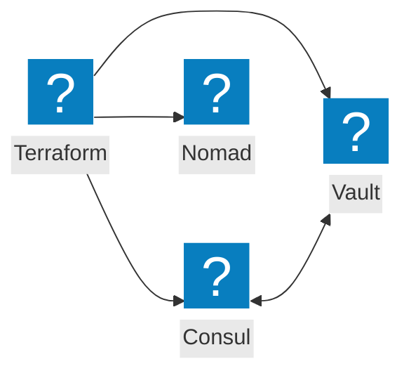
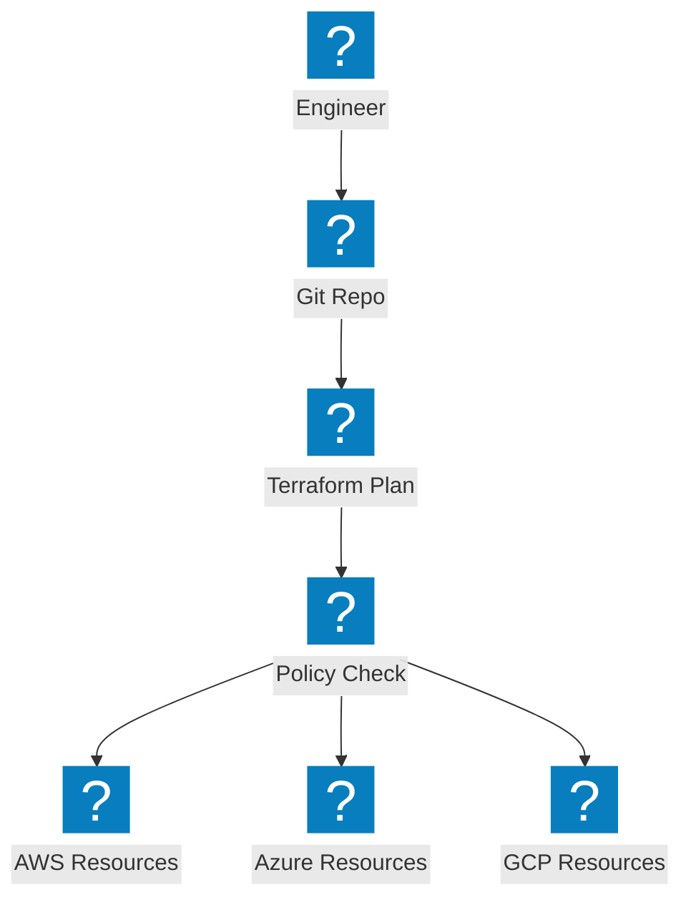

基礎設施即程式碼圖表，涵蓋 Terraform 自動化、HashiCorp 工具整合及多雲端佈建工作流程。

## HashiCorp 堆疊整合

Terraform 協調基礎設施佈建，搭配 Consul 進行服務探索、Vault 管理機密，以及 Nomad 排程工作負載。

## 多雲端 IaC 管線

Terraform 跨 AWS、Azure 及 GCP 佈建基礎設施，並進行狀態管理與政策執行。

## F5 XC 基礎設施自動化

Terraform 自動化 F5 分散式雲端設定，包含負載平衡器、原始伺服器池及安全政策。

```mermaid
architecture-beta
  group iac(hashicorp-flight:terraform-color)[Terraform Workspace]
  group xc(lucide:cloud)[F5 XC Tenant]

  service tfplan(hashicorp-flight:terraform-color)[Terraform] in iac
  service vault(hashicorp-flight:vault-color)[Vault Secrets] in iac
  service consul(hashicorp-flight:consul-color)[Consul Registry] in iac
  service waap(f5xc:web-app-and-api-protection)[WAAP Policy] in xc
  service lb(f5xc:multi-cloud-app-connect)[App Connect] in xc
  service dns(f5xc:dns-management)[DNS Config] in xc

  tfplan:R --> L:vault
  vault:R --> L:consul
  tfplan:B --> T:waap
  tfplan:B --> T:lb
  tfplan:B --> T:dns
```

