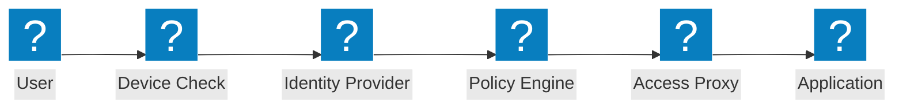
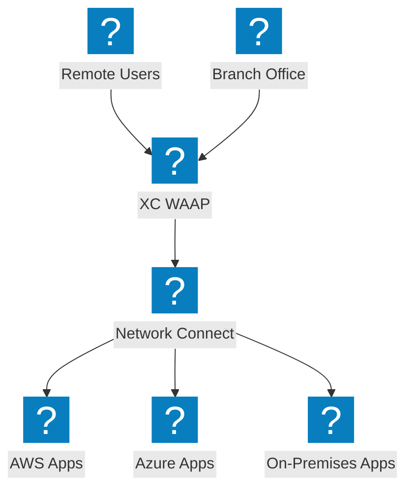

零信任架構圖表，涵蓋 ZTNA 存取流程、身份驗證、基於策略的存取控制，以及整合 F5 XC 的微分段。

## 零信任存取流程

零信任存取流程，包含裝置態勢檢查、身份驗證、策略評估及代理應用程式存取。

## F5 XC 零信任架構

F5 分散式雲端提供零信任應用程式存取，具備 WAAP、身份感知代理及跨雲端微分段功能。

## 微分段架構

網路微分段透過基於身份的策略，控制應用程式各層之間的東西向流量。

```mermaid
architecture-beta
  group trust(lucide:shield)[Zero Trust Fabric]
  group apps(carbon:cloud-services)[Application Tiers]

  service idp(lucide:key)[Identity Provider] in trust
  service policy(carbon:gateway-security)[Policy Engine] in trust
  service seg(carbon:subnet-acl-rules)[Segmentation] in trust
  service web(carbon:application)[Web Tier] in apps
  service api(carbon:api)[API Tier] in apps
  service data(carbon:data-base)[Data Tier] in apps

  idp:R --> L:policy
  policy:R --> L:seg
  seg:R --> L:web
  web:R --> L:api
  api:R --> L:data
```

